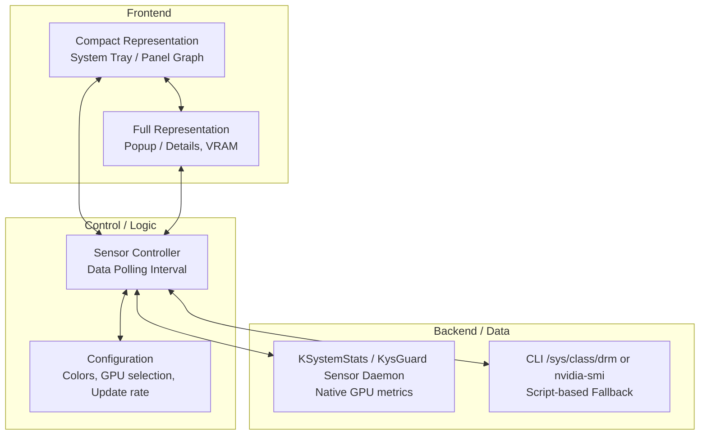

# GPU Monitor Plasmoid (KDE Plasma) - Technical Specification & Concept

## 1. Architectural Overview
The project is realized as a native **KDE Plasma Widget (Plasmoid)** based on the standard `KPackage` layout. The architecture is divided into three layers:



---

## 2. Technical Stack

*   **Base Framework:** **KDE Plasma 6 (Qt 6 / C++ Core)** using QML for the declarative user interface.
*   **Frontend (UI):**
    *   **QML & Qt Quick 2:** For hardware-accelerated rendering of the GPU load graph.
    *   **PlasmaComponents 3 (QtQuick.Controls):** For seamless integration with the active KDE desktop theme (colors, fonts, spacing, icons).
    *   **Kirigami 2 (KDE Frameworks):** For modern UI components, especially in the settings dialog.
*   **Data Acquisition (Backend):**
    *   **KSystemStats (Recommended):** The modern KDE subsystem for querying system sensors, providing native GPU metrics for AMD (amdgpu), Intel, and NVIDIA.
    *   **DataSource (QML interface):** For executing CLI commands directly as a fallback if native KSystemStats sensors are unavailable (e.g., executing `nvidia-smi` for NVIDIA cards or reading `/sys/class/drm/card0/device/gpu_busy_percent` for AMD cards).

---

## 3. UI Concepts

1.  **Compact Representation (Panel):**
    *   A minimalist icon or a small real-time line/circular graph displaying the current GPU utilization in percent (e.g., `42%`).
2.  **Full Representation (Popup on Click):**
    *   Detailed historical graph (timeline of the last 60 seconds).
    *   Additional metrics: Video RAM (VRAM) usage, GPU temperature, and fan speed (if exposed by the system).

---

## 4. Proposed Directory Structure

```text
gpu-monitor-kde/
├── metadata.json                 # Widget metadata (ID, name, Plasma 6 compatibility)
├── Makefile                      # install / upgrade / uninstall / test / view targets
├── contents/
│   ├── config/
│   │   ├── config.qml            # Config dialog categories
│   │   └── main.xml              # Configuration schema (Update interval, etc.)
│   └── ui/
│       ├── main.qml              # Main entry point, sensors & GPU auto-detection
│       ├── CompactRepresentation.qml # UI for the panel/system tray
│       ├── FullRepresentation.qml    # UI for the expanded popup
│       ├── configGeneral.qml     # Configuration UI (Update interval, graph color, etc.)
│       ├── code/
│       │   └── formatter.js      # Pure helper functions (unit-tested)
│       └── locale/               # Compiled gettext catalogs (generated)
├── po/
│   ├── template.pot              # Message template for translators
│   └── de.po                     # German translation
└── tests/
    ├── run-tests.sh              # Full test suite (structure, lint, unit tests, packaging)
    └── tst_formatter.qml         # QML unit tests for formatter.js
```

---

## 5. Deployment & Testing (Workflow)
*   **Local Installation:** The widget is installed to the local user directory (`~/.local/share/plasma/plasmoids/`) using `kpackagetool6 --type Plasma/Applet --install .`.
*   **Testing:** For rapid development, `plasmoidviewer -a org.kde.gpu-monitor` is used to test the widget without needing to restart the desktop environment or Plasma shell.
